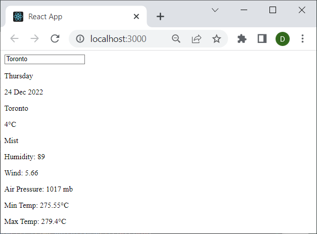
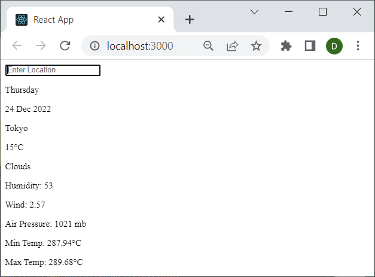
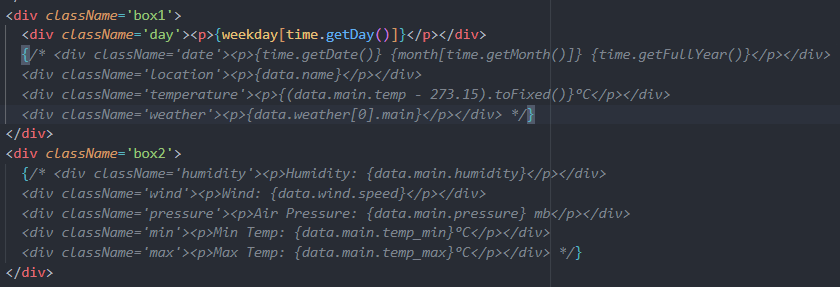
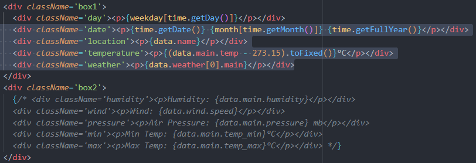
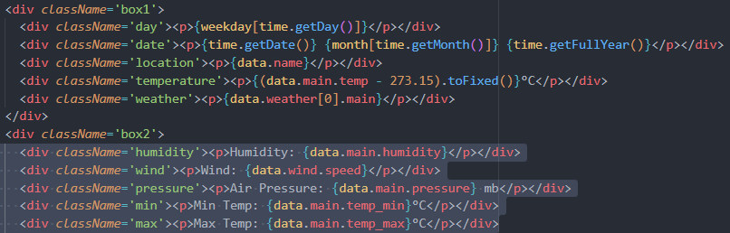

## Outputs

## Bug

The program works but there is a bug where the screen doesn't display initially, or if you refresh

Bug can be fixed by commenting out this code, saving/running app, then them

It breaks again if you refresh.

1

2

3
